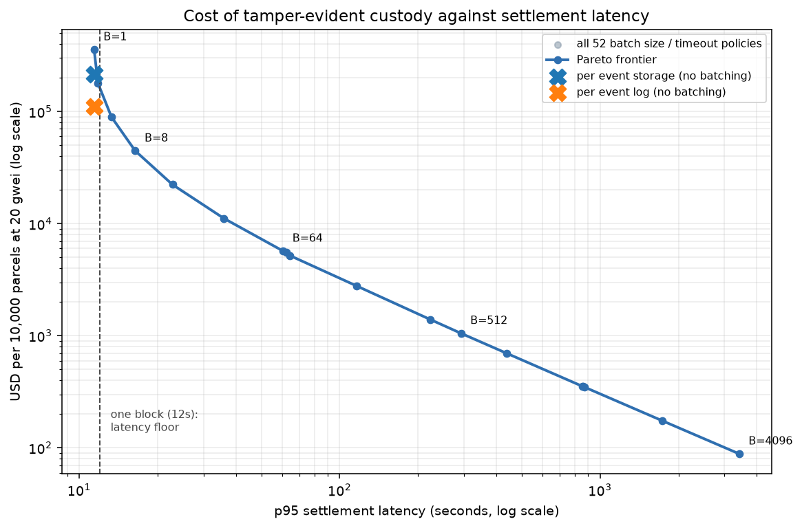

# parcelproof

[](https://github.com/BruceMoseti/parcelproof/actions/workflows/ci.yml)
[](pyproject.toml)
[](foundry.toml)
[](LICENSE)

A tamper-evident parcel custody ledger, and a measurement of what it costs to run.

Custody events stay in an ordinary database. Only the Merkle root of each batch goes on-chain, so an
operator with full write access to that database cannot alter a delivery record without invalidating
its inclusion proof. `make demo` shows exactly that, in six steps, against a real EVM.

**Research question.** On-chain anchoring makes custody records tamper-evident, but every anchor
costs gas and delays settlement. What anchoring policy minimises cost per custody event subject to a
settlement latency budget, and what does provenance actually cost per ten thousand parcels?

That question is worth asking because cost is the real reason logistics operators do not put custody
records on-chain, and the curve is not published anywhere.

Everything below is measured. Every gas figure comes from a transaction receipt against a local EVM
node, recorded in a CSV under [`results/tables/`](results/tables) by a script in
[`benchmarks/`](benchmarks), and `make all` reproduces all of it from scratch. Gas on the EVM is
deterministic, so the reproduction is byte-identical rather than merely close: a
[CI job](.github/workflows/ci.yml) re-measures on every push and fails if a single number moves.
Dollar figures are gas multiplied by a **stated assumption** of 20 gwei and \$3,000/ETH, and the
assumption is recorded next to every result in
[`price_scenarios.csv`](results/tables/price_scenarios.csv).

---

## Headline results

681,401 custody events, from a parcel lifecycle model averaging 8.1 events per parcel at 500 parcels
per hour over one week. Solidity 0.8.28, `evm_version = cancun`, executed on the Prague hardfork.

| Strategy | Transactions | Gas per event | p95 settlement latency | USD per 10,000 parcels |
|---|---|---|---|---|
| One storage slot per event | 681,401 | 43,936 | 11.4 s | \$213,536 |
| One log entry per event | 681,401 | 22,922 | 11.4 s | \$111,404 |
| Merkle anchor, B=1 | 681,401 | 73,370 | 11.4 s | \$356,591 |
| Merkle anchor, B=16 | 42,588 | 4,586 | 22.8 s | \$22,287 |
| Merkle anchor, B=256 | 2,662 | 287 | 223 s | \$1,393 |
| **Merkle anchor, B=4096** | **169** | **18.2** | **3,420 s** | **\$88.56** |

Source: [`strategy_comparison.csv`](results/tables/strategy_comparison.csv).



**The cheapest policy that meets each latency budget**, searched over 52 combinations of batch size
and anchor timeout ([`sla_optimal.csv`](results/tables/sla_optimal.csv), grid in
[`frontier.csv`](results/tables/frontier.csv)):

| p95 budget | Best policy | Gas per event | p50 latency | p95 latency | USD per 10,000 parcels |
|---|---|---|---|---|---|
| 1 minute | B=32, timeout 60 s | 2,292.9 | 19.3 s | 35.9 s | \$11,143.69 |
| 5 minutes | B=512, timeout 5 min | 216.6 | 156.4 s | 292.1 s | \$1,052.52 |
| 15 minutes | B=1024, timeout 1 h | 71.7 | 460.5 s | 870.3 s | \$348.65 |
| 1 hour | B=4096, timeout 1 h | 18.2 | 1,806.7 s | 3,420.3 s | \$88.56 |

### What the measurements show

1. **Batching is the whole ballgame, and the size of the effect is the finding.** Anchoring in
   batches of 4,096 costs **\$88.56 per 10,000 parcels** against **\$213,536** for a storage write
   per event: a **2,411x** reduction, at a p95 settlement latency under an hour. Accept a 15 minute
   budget instead and it is \$348.65, still **612x** cheaper. On-chain provenance is not expensive
   because of the chain; it is expensive if you anchor one event at a time.

2. **Merkle anchoring is the *worst* option until it is amortised.** At B=1 it costs 73,370 gas per
   event, more than a bare storage write (43,936) and more than three times a log entry (22,922),
   because a root committing to a single leaf is pure overhead. It overtakes storage writes only at
   B=2 (36,685) and log entries at B=4 (18,343). The commitment has to be paid for before it pays.

3. **There is a knee, and it sits at B=256.** Settlement latency has a floor of one block, so while
   batch fill time is below ~12 seconds, larger batches cut cost almost for free. Past that, cost
   and latency trade one for one. Measuring it as the product of gas per event and p95 latency, the
   product falls steeply and then flattens: 1,243% above its asymptote at B=1, 6.7% at B=128, and
   **2.7% at B=256**, the first batch size within 5% of the floor. Below the knee you are buying
   cost reductions cheaply; above it you are paying full price in latency.

4. **The same policy costs a small depot 50x more than a national hub, and its batch size stops
   meaning anything.** At 5,000 parcels per hour, B=4096 costs \$87.17 per 10,000 parcels and the
   timeout fires on 0.1% of batches. At 10 parcels per hour the identical policy costs
   **\$4,392.50**, because batches never fill and the timeout flushes **100%** of them: the realised
   batch is 81.4 events, which is exactly the hourly event rate times the one hour timeout. At that
   volume B=256 and B=4096 produce byte-identical results, because the configured size is no longer
   the binding constraint. Batch size is not a throughput-independent design choice
   ([`rate_sensitivity.csv`](results/tables/rate_sensitivity.csv)).

5. **Deep inclusion proofs are priced by the EIP-7623 calldata floor, not by hashing.** Verifying a
   proof on-chain costs 26,889 gas for a batch of one and 38,790 for a batch of 4,096. Each of the
   first eight proof levels costs 863 gas on average, which is 512 gas of calldata plus one keccak.
   The ninth costs 1,151, and every level after it costs **exactly 1,280 gas** — that is 10 gas per
   token x 4 tokens per non-zero byte x 32 bytes, the Prague calldata floor taking over from
   standard pricing partway through. Consistent with that, a 12-hash proof costs 4.1% more on Prague
   and Osaka than on Shanghai and Cancun, while `record` and `anchor` are identical to the gas
   across all four ([`hardfork_sensitivity.csv`](results/tables/hardfork_sensitivity.csv)).

6. **The gas numbers are exactly reproducible, and the one source of variation is understood.**
   Repeated identical calls differ by 0.02–0.05%, entirely because a zero byte of calldata costs 4
   gas and a non-zero byte costs 16, and event hashes contain a random number of zero bytes.
   Removing that discount collapses every sample to a single value, which is asserted in
   [`tests/test_onchain.py`](tests/test_onchain.py) and is what licenses pricing 681,401 events from
   32 measured transactions.

---

## Tamper evidence

The security property, and the reason the ledger is built the way it is:

> Once a batch root is anchored, editing any custody record in that batch invalidates the inclusion
> proofs of **every** event in it.

The ledger stores event content but deliberately never stores the leaf hash. Recording it would
create a second source of truth that verification code could be tempted to trust; without it,
verification has no choice but to recompute the leaf from the columns as they stand right now. The
demo edits rows directly, behind the append path, exactly as an operator with database access could:

```
5. Tamper with the record, as a database operator could
-------------------------------------------------------
location    ORD-06 -> PHX-08
the row is edited and the database is internally consistent
off-chain   REJECTED - record does not match the anchored root
on-chain    REJECTED - record does not match the anchored root
```

`make demo` runs the whole sequence — ingest, seal, anchor, prove, tamper, detect, restore — in
about a second on a throwaway EVM node, with no configuration and no network access.
[`tests/test_tamper.py`](tests/test_tamper.py) covers the cases that matter, including the attempted
cover-up of re-sealing a fresh batch over edited data, which produces an internally consistent root
that is still not the anchored one.

---

## Architecture

```
custody events (parcel_id, sequence, type, actor, location, occurred_at)
        |
canonical encoding  ---- length prefixed fields, so no value can fake a field boundary
        |
leaf hash  ---- keccak256(0x00 || encoding)
        |
SQLite custody log  ---- content only, never the leaf hash
        |
anchor policy  ---- flush at B pending events, or after T seconds
        |
Merkle tree  ---- sorted pairs, 0x01 node prefix, odd nodes promoted not duplicated
        |
MerkleAnchor.anchor(root, leafCount)  ---- 32 bytes on-chain per batch
        |
inclusion proof  ---- log2(B) hashes, recomputed from current database contents
        |
MerkleAnchor.verify(batchId, leaf, proof)  ---- accepts or rejects
```

| Module | Responsibility |
|---|---|
| [`contracts/src/CustodyAnchor.sol`](contracts/src/CustodyAnchor.sol) | The three anchoring strategies and the Merkle library |
| [`src/parcelproof/events.py`](src/parcelproof/events.py) | Custody events and their canonical byte encoding |
| [`src/parcelproof/merkle.py`](src/parcelproof/merkle.py) | Tree, proofs, verification; mirrors the Solidity library |
| [`src/parcelproof/ledger.py`](src/parcelproof/ledger.py) | The off-chain custody log, batch sealing, proof generation |
| [`src/parcelproof/policy.py`](src/parcelproof/policy.py) | Anchor policy and its settlement latency model |
| [`src/parcelproof/trace.py`](src/parcelproof/trace.py) | Parcel lifecycle model and the arrival stream |
| [`src/parcelproof/chain.py`](src/parcelproof/chain.py) | Local EVM node, deployment, gas from receipts |
| [`src/parcelproof/cost.py`](src/parcelproof/cost.py) | Gas to USD, keeping measurements and assumptions apart |
| [`benchmarks/measure_gas.py`](benchmarks/measure_gas.py) | Every gas figure published in this README |
| [`benchmarks/run_frontier.py`](benchmarks/run_frontier.py) | The policy sweep, the SLA search, the frontier |

More detail, including the threat model and what the contract does and does not bind, is in
[`docs/ARCHITECTURE.md`](docs/ARCHITECTURE.md).

The Python and Solidity Merkle implementations were written separately and are held together by
[`tests/test_onchain.py`](tests/test_onchain.py), which requires roots built in Python to be accepted
by proofs verified inside the EVM across seven batch shapes, including the odd counts that trigger
node promotion. Two implementations that agree is the check that the tree shape is genuinely
specified rather than merely self-consistent.

---

## Reproducing

Requires Python 3.11+ and [Foundry](https://getfoundry.sh). No Docker, no database server, no RPC
provider, no funded account: the benchmark and the tests each start their own Anvil node.

```bash
make install     # pip install -e ".[dev]", and check forge is present
make test        # 12 Solidity tests, 92 Python tests
make demo        # ingest, anchor, prove, tamper, detect
make all         # rebuild every table in results/tables and figure in results/figures
```

`make all` takes about 40 seconds end to end, most of it the 52 policy simulations over 681,401
events.

Reproducibility rests on pinning the things that silently change gas, all in
[`foundry.toml`](foundry.toml) and [`chain.py`](src/parcelproof/chain.py): the compiler version, the
EVM version, the optimizer settings, `bytecode_hash = "none"` so no metadata hash lands in the
bytecode, and the Anvil hardfork. Anvil defaults to `latest`, which follows whatever fork is newest
in the installed Foundry build — including unreleased ones — so leaving it alone would mean the
published tables changed on every toolchain upgrade. Finding 5 is what that default would have cost.

---

## Method and limits

Stated plainly, because they bound what the numbers mean.

- **The parcel trace is a model, not carrier data.** Facility dwell and line-haul times are
  lognormal with medians of about 3.3 and 8.2 hours. It is calibrated to be plausible, not to a real
  network, and it drives only the arrival rate and the 8.1 events per parcel. No cost finding
  depends on its shape beyond that.
- **The policy sweep uses a stationary Poisson arrival stream, not the raw parcel trace.** A finite
  trace is not stationary: shipments enter over a window and then drain for as long as delivery
  takes, and its arrival rate varies by four orders of magnitude between the middle and the tail.
  Percentiles taken over the whole thing would judge large batches mostly on a near-empty tail,
  which is an artefact of the trace ending. The stream's rate is derived from the lifecycle model
  rather than picked.
- **Settlement latency means block inclusion, on a fixed 12 second slot schedule.** Waiting for
  finality instead adds roughly two epochs to every policy equally, shifting the whole curve without
  changing which policy sits on the frontier.
- **Dollar costs are gas times an assumed price.** Gas is measured; 20 gwei and \$3,000/ETH are not.
  Three scenarios spanning 5 to 50 gwei are tabulated, and the ratios between strategies are
  price-independent.
- **This is L1 pricing.** A rollup would change every dollar figure and none of the gas figures.
  The comparison between strategies, and the shape of the frontier, carry over; the absolute costs
  do not.
- **The contract verifies membership, not meaning.** It checks that a leaf is in a committed batch.
  Nothing on-chain binds a leaf to the event fields that produced it, because that would mean
  putting the encoding on-chain and paying calldata for it. The consequence is spelled out in
  [`docs/ARCHITECTURE.md`](docs/ARCHITECTURE.md).

## Deliberately not built

- **No token, coin, or NFT.** Nothing here needs one.
- **No IPFS, no multi-chain support, no wallet integration, no admin dashboard.** None of them
  unlock a number in `results/`, which is the bar for adding infrastructure to this repository.
- **No mainnet or testnet deployment.** A local Anvil node gives identical gas accounting, and the
  measurements are the point.

## License

MIT. See [LICENSE](LICENSE).
